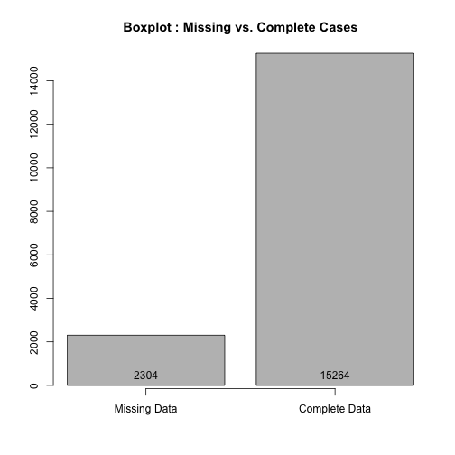
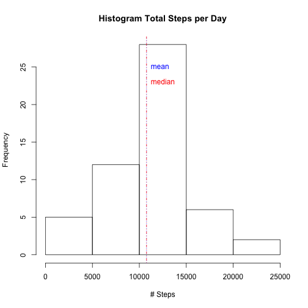
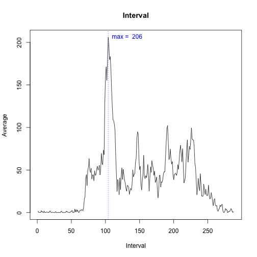
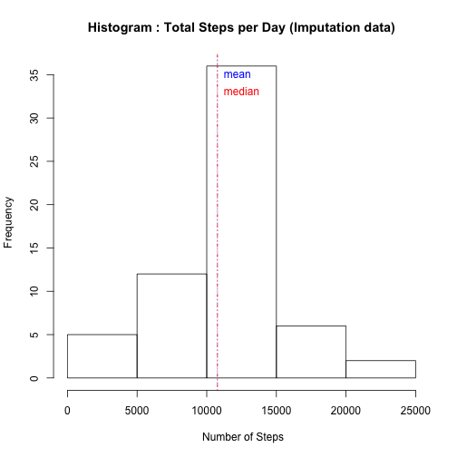
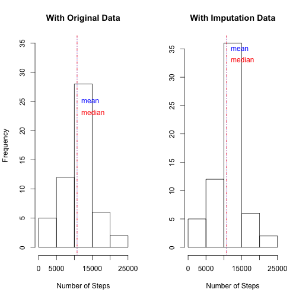

## Reproducible Research -- Peer Assessment 1
### Loading and preprocessing the data
Reading data from excel


```r
mydata <- read.csv("activity.csv")
```

###The summary of the data


```r
summary(mydata)
```

```
##      steps                date          interval     
##  Min.   :  0.00   2012-10-01:  288   Min.   :   0.0  
##  1st Qu.:  0.00   2012-10-02:  288   1st Qu.: 588.8  
##  Median :  0.00   2012-10-03:  288   Median :1177.5  
##  Mean   : 37.38   2012-10-04:  288   Mean   :1177.5  
##  3rd Qu.: 12.00   2012-10-05:  288   3rd Qu.:1766.2  
##  Max.   :806.00   2012-10-06:  288   Max.   :2355.0  
##  NA's   :2304     (Other)   :15840
```


 

### What is mean total number of steps taken per day?

The **mean** and **median** total number of steps taken
per day:

```
## [1] 10766.19
```

```
## [1] 10765
```

 

```
##    Min. 1st Qu.  Median    Mean 3rd Qu.    Max. 
##      41    8841   10760   10770   13290   21190
```

### What is the average daily activity pattern?

 

```
## [1] "835"
```

```
## [1] 206
```

```
## 835 
## 104
```

###Imputing missing values


```r
mydata$steps[is.na(mydata$steps)] = mean(mydata$steps, na.rm=TRUE)
ImpuData = mydata
```

 

```
##    Min. 1st Qu.  Median    Mean 3rd Qu.    Max. 
##      41    9819   10770   10770   12810   21190
```


Make a histogram of the total number of steps taken each day and Calculate and report the mean and median total number of steps taken per day. Do these values differ from the estimates from the first part of the assignment? What is the impact of imputing missing data on the estimates of the total daily number of steps?

**By using the average value for imputation, the only difference is in the frequency or the number of observations for the center bar of the new histogram**
 

###Are there differences in activity patterns between weekdays and weekends?
This person does most of his or her walking on the weekends!

```
## Error in get(as.character(FUN), mode = "function", envir = envir): object 'FUN' of mode 'function' was not found
```

```
## Error in names(stepsByDay) <- c("interval", "day", "steps"): object 'stepsByDay' not found
```

```
## Error in with(stepsByDay, plot(steps ~ interval, type = "n", main = "Weekday vs. Weekend Avg.")): object 'stepsByDay' not found
```

```
## Error in with(stepsByDay[stepsByDay$day == "weekday", ], lines(steps ~ : object 'stepsByDay' not found
```

```
## Error in with(stepsByDay[stepsByDay$day == "weekend", ], lines(steps ~ : object 'stepsByDay' not found
```

```
## Error in strwidth(legend, units = "user", cex = cex, font = text.font): plot.new has not been called yet
```
